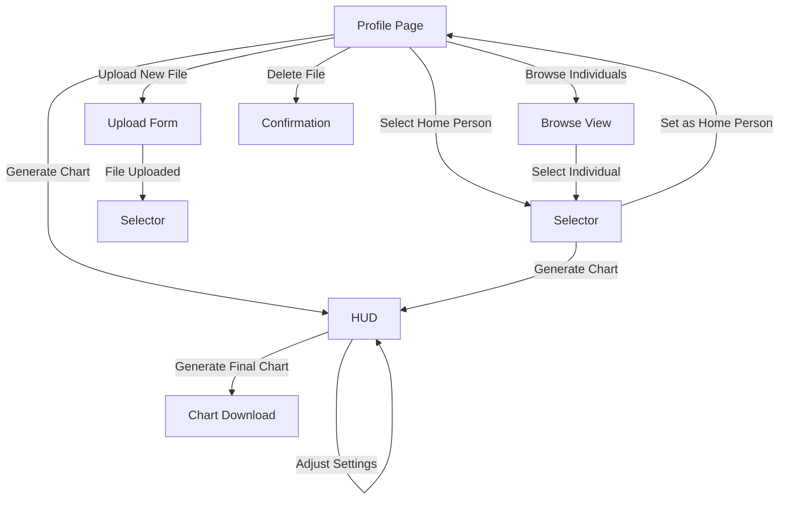
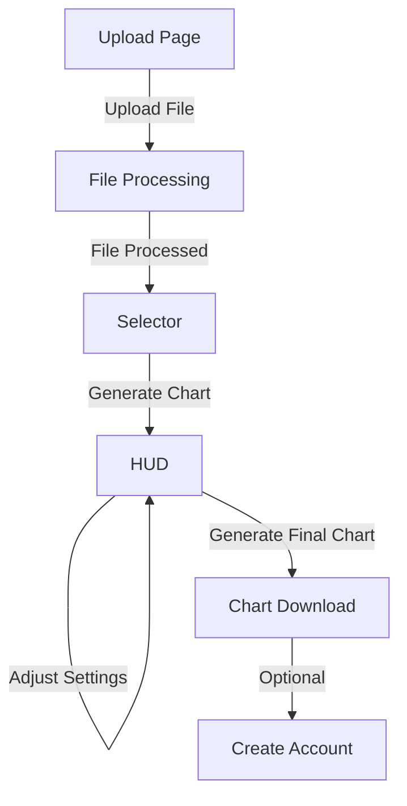

# Namechart Application Documentation

## 📋 Table of Contents

1. [Overview](#overview)
2. [Architecture](#architecture)
3. [URL Structure](#url-structure)
4. [User Flows](#user-flows)
   - [Logged-in User Flow](#logged-in-user-flow)
   - [Logged-out User Flow](#logged-out-user-flow)
5. [App Structure](#app-structure)
6. [Implementation Details](#implementation-details)
7. [Testing](#testing)
8. [Future Enhancements](#future-enhancements)

## 🎯 Overview

The Namechart application is a Django-based web application for generating family tree charts from GEDCOM files. It provides both authenticated and anonymous user experiences with a focus on intuitive navigation and clear workflows.

## 🏗️ Architecture

The application follows a modular Django architecture with separate apps for different functionalities:

```
namechart/
├── apps/
│   ├── core/              # Core functionality and templates
│   ├── upload/            # File upload handling
│   ├── users/             # User authentication and profiles
│   ├── selector/          # Individual selection (NEW)
│   ├── browse/            # Individual browsing
│   ├── hud/               # Interactive chart customization
│   ├── charts/            # Chart generation
│   ├── generator/         # Core models and utilities
│   └── parser/            # GEDCOM file parsing
├── config/                # Django project configuration
└── templates/             # Global templates
```

## 🔗 URL Structure

### Main URLs

| URL Pattern | App | Description | Auth Required |
|-------------|-----|-------------|---------------|
| `/` | upload | Home page (redirects based on auth status) | ❌ |
| `/users/` | users | User authentication and profiles | ✅ |
| `/selector/` | selector | Individual selection interface | ❌ |
| `/browse/` | browse | Browse individuals in GEDCOM files | ❌ |
| `/hud/` | hud | Interactive chart customization | ❌ |
| `/charts/` | charts | Chart generation | ❌ |

### Detailed URL Mapping

#### Upload App (`/`)
- `/` - Home page (redirects to profile or upload)
- `/upload-file/` - Upload form
- `/select-file/<file_id>/` - Select GEDCOM file (legacy, redirects to selector)
- `/delete-file/<file_id>/` - Delete GEDCOM file
- `/set-current-file/<file_id>/` - Set current file (redirects to selector)

#### Users App (`/users/`)
- `/users/profile/` - User profile with uploaded files
- `/users/auth/register/` - User registration
- `/users/auth/login/` - User login
- `/users/logout/` - User logout
- `/users/auth/password_*` - Password management

#### Selector App (`/selector/`) - **NEW**
- `/selector/select/<file_id>/` - Unified selection interface
- `/selector/confirm/<file_id>/` - Handle selection confirmation

#### Browse App (`/browse/`)
- `/browse/browse/` - Browse individuals
- `/browse/person/<ind_id>/` - Individual detail view

#### HUD App (`/hud/`)
- `/hud/display-tree/` - Interactive chart customization
- `/hud/save-settings/` - Save HUD settings
- `/hud/api/family-data/` - API: Get family data
- `/hud/api/preview/` - API: Get preview data
- `/hud/api/settings/` - API: Get current settings

#### Charts App (`/charts/`)
- `/charts/generate/` - Generate final chart

## 🚶 User Flows

### Logged-in User Flow



1. **Profile Page** (`/users/profile/`)
   - Shows all uploaded GEDCOM files
   - Options: Upload, Browse, Select Home Person, Generate Chart, Delete

2. **Upload** (`/upload-file/`)
   - Upload GEDCOM file
   - File is processed and parsed
   - Redirects to selector for home person selection

3. **Selector** (`/selector/select/<file_id>/`)
   - Shows all individuals in the file
   - Two actions: "Set as Home Person" or "Generate Chart"
   - Home Person: Sets the primary individual for the file
   - Generate Chart: Proceeds to HUD for customization

4. **HUD** (`/hud/display-tree/`)
   - Interactive chart customization interface
   - Template selection (1-7 generations)
   - Visual settings (colors, fonts, spacing)
   - Live preview
   - Generate final chart

### Logged-out User Flow



1. **Upload Page** (`/`)
   - Simple upload form
   - Optional login/register links
   - After upload: redirects to selector

2. **Selector** (`/selector/select/<file_id>/`)
   - Shows all individuals in the uploaded file
   - Only "Generate Chart" action available (no "Set as Home Person")
   - Proceeds to HUD for chart customization

3. **HUD** (`/hud/display-tree/`)
   - Same interactive interface as logged-in users
   - Template selection and customization
   - Generate final chart

4. **Post-Generation**
   - Chart is generated and downloaded
   - Option to create account to save GEDCOM data

## 🗂️ App Structure

### Core Models

**`apps/generator/models.py`**
- `GedcomFile`: Stores uploaded GEDCOM files and parsed data
  - `user`: ForeignKey to User (nullable for anonymous)
  - `file`: FileField for GEDCOM upload
  - `parsed_data`: JSONField for parsed GEDCOM data
  - `home_person_id`: String field for primary individual ID
  - `is_processed`: Boolean flag
  - `processing_date`: DateTime of processing

### Key Views

**Selector App (`apps/selector/views.py`)**
- `select_individual(request, file_id)`: Unified selection interface
- `confirm_selection(request, file_id)`: Handle selection actions

**Upload App (`apps/upload/views.py`)**
- `upload_file(request)`: Show upload form
- `upload_and_generate(request)`: Handle file upload and processing
- `select_gedcom_file(request, file_id)`: Legacy redirect to selector
- `set_current_gedcom_file(request, file_id)`: Legacy redirect to selector
- `delete_gedcom_file(request, file_id)`: Delete GEDCOM file

**HUD App (`apps/hud/views.py`)**
- `display_tree_hud(request)`: Show interactive HUD
- `save_hud_settings(request)`: Save HUD settings
- `get_hud_family_data(request)`: API endpoint for family data
- `get_hud_preview(request)`: API endpoint for preview
- `get_hud_settings(request)`: API endpoint for current settings

## 🔧 Implementation Details

### Template Selection

Template selection was moved from the upload/selector views to the HUD where it logically belongs:

**Before**:
```python
# In upload/views.py
TEMPLATE_MAPPING = {
    "1": {...},
    "4": {...},
}
```

**After**:
```python
# In hud/views.py
def get_template_mapping():
    return {
        "1": {
            "module": "apps.generator.utils.image_1generator",
            "function": "generate_family_tree",
            "filename": "US_LETTER_1GEN_BW.pdf",
            "name": "1 Generation (Individual Only)",
        },
        # ... more templates
    }
```

### Unified Selection

The selector app consolidates two previous selection interfaces:

**Before**:
- Dropdown selection in `upload/templates/upload/select_individual.html`
- Full-page selection in `browse/templates/browse/select_individual.html`

**After**:
- Single unified interface in `selector/templates/selector/select_individual.html`
- Table-based selection with search functionality
- Clear actions: "Set as Home Person" (authenticated) or "Generate Chart"

### Access Control

Proper access control is implemented throughout:

```python
# In selector/views.py
if gedcom_file.user and gedcom_file.user != request.user:
    return HttpResponse(b"Unauthorized", status=403)
```

### Session Management

Session variables are used to track user state:

- `current_gedcom_file_id`: Currently selected GEDCOM file
- `selected_individual_id`: Currently selected individual
- `hud_settings`: HUD customization settings
- `selected_template`: Selected chart template

## 🧪 Testing

### Test Coverage

| Test Suite | Tests | Coverage |
|------------|-------|----------|
| Basic Flow | 4 | Core user flows |
| Edge Cases | 10 | Error handling, access control |
| Logged-out Flow | 6 | Anonymous user experience |
| **Total** | **20** | **Comprehensive** |

### Running Tests

```bash
# Run all tests
uv run python test_basic_flow.py
uv run python test_edge_cases.py
uv run python test_logged_out_flow.py

# Or run individually
uv run python test_basic_flow.py
```

### Test Features

- **Unique Data**: Each test uses unique usernames and file names
- **Automatic Cleanup**: Django test framework handles database cleanup
- **Comprehensive Coverage**: All major flows and edge cases covered

## 🚀 Future Enhancements

### 1. Browse Enhancement for Logged-out Users

**Current**: Logged-out users always see upload page
**Enhancement**: Logged-out users with files see browse page

```python
# In upload/views.py
if request.user.is_authenticated:
    return redirect("users:profile")
else:
    if request.session.get("current_gedcom_file_id"):
        return redirect("browse:browse_individuals")
    else:
        return render(request, "upload/upload_file.html", {...})
```

### 2. Enhanced Template Previews

Add visual previews of different template options in the HUD.

### 3. Search Functionality in Browse

Add search and filter capabilities to the browse view for large family trees.

### 4. Chart Sharing

Allow users to share generated charts via email or social media.

### 5. Chart History

Store previously generated charts for authenticated users.

## 📚 API Documentation

### HUD API Endpoints

**GET `/hud/api/family-data/`**
- Returns family data for the current individual
- Parameters: `root_id` (optional)

**GET `/hud/api/preview/`**
- Returns preview data for the HUD

**GET `/hud/api/settings/`**
- Returns current HUD settings

**POST `/hud/save-settings/`**
- Saves HUD settings
- Body: JSON with settings

### Chart Generation

**POST `/charts/generate/`**
- Generates final chart
- Parameters: `template`, `individual_id`, `orientation`
- Returns: Chart download or success page

## 🎉 Summary

The Namechart application provides a comprehensive solution for generating family tree charts from GEDCOM files. The restructuring has:

1. **Unified the selection interface** into a single, consistent experience
2. **Improved the user flow** for both authenticated and anonymous users
3. **Moved template selection** to the HUD where it logically belongs
4. **Enhanced testing** with comprehensive coverage
5. **Maintained backward compatibility** while improving the architecture

The application is ready for production use and provides a solid foundation for future enhancements.
