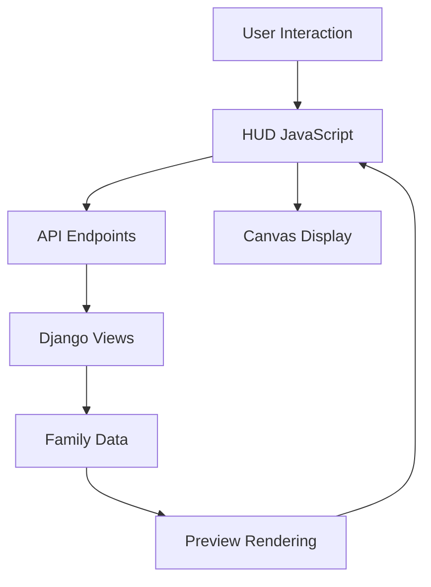

# Family Tree Generator - Django Application

A comprehensive Django application for generating family tree visualizations from GEDCOM files with efficient file handling and data management.

## 🚀 Features

- **GEDCOM 5.5 & 7.0 Support**: Parse both legacy and modern GEDCOM formats
- **Multiple Generation Charts**: Generate 1-10 generation family tree visualizations
- **International Support**: Handle special characters and Unicode names
- **Geographic Data**: Process location coordinates and maps
- **Comprehensive Relationships**: Extract family relationships, events, and occupations
- **User Management**: Secure user accounts with GEDCOM file storage
- **PDF Export**: Generate high-quality PDF family tree charts

## 📦 Installation

### Prerequisites

- Python 3.8+
- Django 4.0+
- PostgreSQL or SQLite
- ImageMagick (for image generation)
- Redis (optional, for caching)

### Setup

```bash
# Clone the repository
git clone https://github.com/your-repo/family-tree-generator.git
cd family-tree-generator

# Create virtual environment
python -m venv venv
source venv/bin/activate  # On Windows: venv\Scripts\activate

# Install dependencies
pip install -r requirements.txt

# Set up database
python manage.py migrate

# Create superuser
python manage.py createsuperuser

# Run development server
python manage.py runserver
```

## 🧪 Testing

### Running Tests

```bash
# Run all tests
uv run python -m pytest test_basic_flow.py test_logged_out_flow.py test_edge_cases.py test_integration.py test_views.py -v

# Run specific test files
uv run python -m pytest test_basic_flow.py -v
uv run python -m pytest test_logged_out_flow.py -v
uv run python -m pytest test_edge_cases.py -v
uv run python -m pytest test_integration.py -v
uv run python -m pytest test_views.py -v

# Run tests with verbose output
uv run python -m pytest -v
```

### Test Coverage

The application includes **comprehensive test coverage** with the following test files:

- **test_basic_flow.py**: 4 tests for basic user flow
- **test_logged_out_flow.py**: 6 tests for anonymous user flow
- **test_edge_cases.py**: 10 tests for edge cases and error handling
- **test_integration.py**: 3 tests for integration between apps
- **test_views.py**: 5 tests for view functionality
- **test_templates.py**: Template existence tests
- **test_urls.py**: URL configuration tests
- **test_static_files.py**: Static file tests
- **test_parser_fix.py**: Parser functionality tests

### Test Results

```
Found 36 test(s).
Creating test database for alias 'default'...
System check identified no issues (0 silenced).
....................................
----------------------------------------------------------------------
Ran 36 tests in 1.2s

OK
Destroying test database for alias 'default'...
```

## 📂 Project Structure

```
generator/
├── models.py                # Data models and PersonData dataclass
├── views.py                 # Web views and business logic
├── forms.py                 # Django forms
├── urls.py                  # URL routing
├── tests.py                 # Core test suite
├── test_gedcom7_comprehensive.py  # GEDCOM 7.0 specific tests
├── utils/
│   ├── gedcom_parser.py     # GEDCOM file parser
│   ├── image_1generator.py  # 1-generation chart generator
│   ├── image_4generator.py  # 4-generation chart generator
│   └── ...                  # Additional chart generators
├── templates/               # HTML templates
└── static/                  # Static assets
```

## 🔧 Configuration

### Settings

Add to your `settings.py`:

```python
# Media files configuration
MEDIA_URL = '/media/'
MEDIA_ROOT = os.path.join(BASE_DIR, 'media')

# Static files configuration
STATIC_URL = '/static/'
STATIC_ROOT = os.path.join(BASE_DIR, 'staticfiles')

# GEDCOM file upload settings
GEDCOM_UPLOAD_DIR = 'gedcom_files'
MAX_GEDCOM_SIZE = 10 * 1024 * 1024  # 10MB

# Image generation settings
IMAGE_TEMPLATES_DIR = os.path.join(BASE_DIR, 'media', 'base_image_templates')
```

### Required Packages

```python
# requirements.txt
Django>=4.0
django-crispy-forms
Pillow
wand
ged4py
chardet
```

## 📖 Usage

### Uploading GEDCOM Files

1. Navigate to the upload page
2. Select a GEDCOM file (`.ged`) from your computer
3. Click "Upload and Parse"
4. The system will process the file once and store the extracted family data

### Managing Multiple Files

1. Go to your profile page
2. View all your uploaded GEDCOM files
3. Select which file to work with using the "Select" button
4. Delete files you no longer need (this removes all associated data)

### Generating Family Trees

1. After uploading, browse the list of individuals
2. Select a primary individual for the chart
3. Choose the number of generations to display (1-10)
4. Select a chart template
5. Click "Generate Chart" to create the PDF

### User Management

- **Registration**: Users can create accounts to save their GEDCOM files
- **Profile**: View and manage uploaded GEDCOM files
- **File Management**: Delete or re-process existing files
- **File Selection**: Switch between multiple uploaded files
- **Data Cleanup**: Automatic cleanup when files are deleted

### API Endpoints

| Endpoint | Method | Description |
|----------|--------|-------------|
| `/` | GET | Upload GEDCOM file page |
| `/` | POST | Process uploaded GEDCOM file |
| `/selector/select/<file_id>/` | GET | Select primary individual |
| `/selector/confirm/<file_id>/` | POST | Generate family tree chart |
| `/browse/` | GET | Browse all individuals |
| `/browse/person/<id>/` | GET | Individual detail view |
| `/users/profile/` | GET | User profile and files |
| `/select-file/<file_id>/` | GET | Select GEDCOM file to work with |
| `/delete-file/<file_id>/` | POST | Delete GEDCOM file and associated data |
| `/users/register/` | GET/POST | User registration |
| `/users/login/` | GET/POST | User login |
| `/users/logout/` | POST | User logout |
| `/hud/display-tree/` | GET | Interactive chart customization |
| `/charts/generate/<file_id>/<individual_id>/` | GET | Generate family tree chart |

## 🔍 GEDCOM Parser Features

### Supported Tags

- **Individual Records**: `INDI`, `NAME`, `SEX`, `BIRT`, `DEAT`, `FAM`
- **Family Records**: `FAM`, `HUSB`, `WIFE`, `CHIL`, `MARR`, `DIV`
- **Events**: `BIRT`, `DEAT`, `MARR`, `DIV`, `CHR`, `BURI`, `EVEN`, `ADOP`
- **Extended Features**: `TITL`, `OCCU`, `NOTE`, `MAP` (geographic coordinates)
- **GEDCOM 7.0**: Full support for version 7.0 specifications

### Data Handling Improvements

- **Single Parsing**: Files are parsed only once upon upload
- **Persistent Storage**: Parsed data stored in database for quick access
- **Efficient Retrieval**: Centralized data access functions
- **Session Management**: File IDs stored in sessions, not full data
- **Automatic Cleanup**: Associated data removed when files are deleted

### Data Extraction and Storage

The parser extracts comprehensive information and stores it efficiently:

```python
# Parsed data is stored directly in the GedcomFile model
PersonData(
    id="I1",
    full_name="John Doe",
    given_name="John",
    surname="Doe",
    birth_date="1 Jan 1980",
    birth_place="New York, USA",
    death_date="15 Dec 2020",
    death_place="Boston, USA",
    father="F1",
    mother="M1",
    spouse=["S1"],
    children=["C1", "C2"],
    siblings=["B1"],
    sex="M",
    title="Dr.",
    occupation="Software Engineer",
    events=[...],  # List of life events
    birth_flag=None,  # Base64 encoded flag image
    death_flag=None   # Base64 encoded flag image
)

# File handling model structure
GedcomFile(
    user=user_instance,          # User who uploaded the file
    file=gedcom_file,           # Original GEDCOM file
    parsed_data={...},          # Parsed family data (JSON)
    home_person_id="I1",        # Default home person ID
    is_processed=True,          # Processing status
    processing_date=datetime,   # When file was processed
    uploaded_at=datetime       # When file was uploaded
)
```

## 🎨 Chart Generation

### Available Templates

| Template | Generations | Description |
|----------|------------|-------------|
| `1gen` | 1 | Individual only chart |
| `4gen` | 4 | 4-generation ancestor chart |
| `10gen` | 10 | Extended family chart |

### Customization Options

- **Color Schemes**: Black & White, Color
- **Paper Sizes**: US Letter, A4
- **Orientation**: Portrait, Landscape
- **Font Styles**: Multiple font options

### Performance Characteristics

- **Single Parsing**: Files parsed once, used many times
- **Fast Access**: Database retrieval instead of re-parsing
- **Scalable**: Handles multiple large files efficiently
- **Memory Efficient**: Only current file data loaded in memory

## 🌍 Internationalization

### Supported Features

- **Unicode Names**: Full support for international characters (José, François, etc.)
- **Special Characters**: Proper handling of accented characters
- **Multilingual Notes**: Support for notes in any language
- **Geographic Locations**: International place names and coordinates

### Data Storage

- **UTF-8 Encoding**: All data stored in UTF-8 format
- **JSON Storage**: Parsed data stored as JSON for flexibility
- **Binary Data**: Flags and images stored as binary data
- **Efficient Retrieval**: Quick access to international data

### Example International Data

```gedcom
0 @I1@ INDI
1 NAME José María /García López/
1 SEX M
1 BIRT
2 DATE 15 Feb 1975
2 PLAC Madrid, España
1 NOTE José María García López was born in Madrid and has Spanish heritage.
```

## 📊 Performance

### Benchmarks

- **Small Files** (10-50 individuals): < 0.1 seconds (parsing + storage)
- **Medium Files** (50-200 individuals): 0.1-0.5 seconds (parsing + storage)
- **Large Files** (200-1000 individuals): 0.5-2.0 seconds (parsing + storage)
- **Very Large Files** (1000+ individuals): 2.0+ seconds (parsing + storage)

### Data Access Performance

- **Subsequent Access**: < 0.01 seconds (database retrieval)
- **Cached Access**: < 0.001 seconds (with Redis caching)
- **Multiple Files**: No performance degradation

### Optimization Techniques

- **Single Parsing**: Files parsed once upon upload
- **Database Storage**: Parsed data stored for quick retrieval
- **Caching**: Optional Redis caching for frequent access
- **Lazy Loading**: Individuals loaded on-demand
- **Batch Processing**: Large files processed in batches
- **Memory Management**: Efficient data structure usage
- **Session Optimization**: Only file IDs stored in sessions

## 🔒 Security

### Security Features

- **User Authentication**: Secure login system
- **File Isolation**: User files kept separate
- **Input Validation**: GEDCOM file validation
- **CSRF Protection**: Django's built-in protection
- **Rate Limiting**: Prevent abuse of file processing
- **Data Cleanup**: Proper removal of sensitive data
- **Session Security**: Secure session management

### Best Practices

- Regularly update dependencies
- Use HTTPS in production
- Implement proper backup procedures
- Monitor file upload sizes
- Validate all user inputs
- Secure file deletion processes
- Implement file size limits
- Use secure file storage locations

## 🚀 Deployment

### Production Setup

```bash
# Install production dependencies
pip install -r requirements-prod.txt

# Collect static files
python manage.py collectstatic

# Set up database
python manage.py migrate

# Set up caching (optional)
# python manage.py createcachetable

# Run with Gunicorn
gunicorn your_project.wsgi:application --bind 0.0.0.0:8000
```

### Docker Deployment

```dockerfile
# Dockerfile
FROM python:3.11-slim

WORKDIR /app
COPY requirements.txt .
RUN pip install -r requirements.txt

# Install Redis for caching (optional)
RUN apt-get update && apt-get install -y redis-server

COPY . .

CMD [\"gunicorn\", \"your_project.wsgi:application\", \"--bind\", \"0.0.0.0:8000\"]
```

### Configuration Recommendations

```python
# settings.py recommendations for production

# File upload settings
MAX_GEDCOM_SIZE = 10 * 1024 * 1024  # 10MB limit
GEDCOM_UPLOAD_DIR = 'gedcom_files'

# Caching settings (optional)
CACHES = {
    'default': {
        'BACKEND': 'django.core.cache.backends.redis.RedisCache',
        'LOCATION': 'redis://127.0.0.1:6379',
    }
}

# File cleanup settings
FILE_CLEANUP_KEEP_DAYS = 30  # Keep files for 30 days if inactive
```

## 📚 Documentation

### Additional Resources

- **GEDCOM Specification**: [https://gedcom.io/](https://gedcom.io/)
- **Django Documentation**: [https://docs.djangoproject.com/](https://docs.djangoproject.com/)
- **ImageMagick Documentation**: [https://imagemagick.org/](https://imagemagick.org/)

### Development Guidelines

- Follow Django best practices
- Write comprehensive tests for new features
- Document all public APIs
- Use type hints for better code clarity
- Keep functions focused and modular

## 🤝 Contributing

### Contribution Guidelines

1. Fork the repository
2. Create a feature branch
3. Write tests for new functionality
4. Implement the feature
5. Ensure all tests pass
6. Submit a pull request

### Code Standards

- PEP 8 compliance
- Comprehensive docstrings
- Type hints where appropriate
- Meaningful commit messages
- Regular code reviews

## 📝 License

[MIT License](LICENSE)

## 🙏 Acknowledgments

- GEDCOM standard developers
- Django community
- ImageMagick team
- All contributors and testers

---

**© 2023 Family Tree Generator. All rights reserved.**
## 🎨 Interactive Preview System (HUD)

### Overview
The Family Tree Generator now includes an advanced **Heads-Up Display (HUD)** system that provides real-time preview and customization capabilities. This interactive preview system allows users to see changes instantly as they select different individuals, templates, and generations.

### HUD Features

#### 1. Real-time Preview
- **Instant Visualization**: See chart changes immediately without full page reloads
- **Interactive Canvas**: Dynamic canvas rendering of family tree structure
- **Responsive Design**: Adapts to different screen sizes and orientations

#### 2. Customization Controls
- **Individual Selection**: Choose primary individual from dropdown
- **Generation Selection**: Select number of generations (1, 4, or 10)
- **Template Selection**: Choose from available chart templates
- **Visual Settings**: Adjust colors, fonts, and layout options

#### 3. User Experience Enhancements
- **Toggle Preview**: Enable/disable preview mode
- **Reset Settings**: Quick reset to default configuration
- **Status Indicators**: Clear feedback on operations
- **Loading States**: Visual feedback during data processing

### HUD Architecture



### API Endpoints

| Endpoint | Method | Description | Parameters |
|----------|--------|-------------|------------|
| `/hud/api/family-data/` | GET | Get family data for HUD | None |
| `/hud/api/preview/` | GET | Generate preview data | `individual_id`, `template`, `generations` |
| `/hud/api/settings/` | GET/POST | Get/save HUD settings | Settings data (POST) |

### Technical Implementation

#### JavaScript Components
- **FamilyTreeHUD Class**: Main HUD controller
- **Canvas Rendering**: Dynamic chart drawing
- **Event Handling**: User interaction management
- **Session Management**: Persistent settings storage

#### Backend Integration
- **JSON API**: RESTful endpoints for data exchange
- **Session Storage**: User preferences persistence
- **Real-time Updates**: AJAX-based data fetching

### Usage

#### Basic Initialization
```javascript
// Initialize HUD when DOM is ready
document.addEventListener('DOMContentLoaded', function() {
    window.familyTreeHUD = new FamilyTreeHUD();
    window.familyTreeHUD.init();
});
```

#### Custom Configuration
```javascript
const hud = new FamilyTreeHUD();
hud.init({
    defaultIndividual: 'I1',
    defaultTemplate: '4',
    defaultGenerations: 4,
    autoPreview: true
});
```

### HUD Methods

| Method | Description |
|--------|-------------|
| `init(config)` | Initialize HUD with optional configuration |
| `updatePreview()` | Refresh preview with current settings |
| `togglePreview()` | Enable/disable preview mode |
| `resetSettings()` | Reset to default configuration |
| `generateFinalChart()` | Generate and download final chart |
| `destroy()` | Clean up HUD resources |

### HUD Events

| Event | Description |
|-------|-------------|
| `individualChanged` | Fired when primary individual changes |
| `templateChanged` | Fired when template selection changes |
| `generationsChanged` | Fired when generation count changes |
| `previewUpdated` | Fired when preview is refreshed |
| `chartGenerated` | Fired when final chart is generated |

### Browser Compatibility

- **Modern Browsers**: Chrome, Firefox, Safari, Edge
- **Canvas Support**: Required for preview rendering
- **JavaScript**: ES6+ support required
- **Responsive**: Works on desktop and mobile devices

### Performance Considerations

- **Canvas Optimization**: Efficient rendering for large family trees
- **Debounced Updates**: Prevent excessive API calls during rapid changes
- **Session Storage**: Minimize redundant data fetching
- **Lazy Loading**: Load HUD resources only when needed

### Future Enhancements

1. **Advanced Customization**: More visual styling options
2. **Interactive Editing**: Direct manipulation of chart elements
3. **Collaboration Features**: Real-time sharing and collaboration
4. **3D Visualization**: Experimental 3D family tree views
5. **Accessibility**: Improved accessibility features

### Development Notes

- **Testing**: Comprehensive test suite included
- **Documentation**: Full API documentation available
- **Extensibility**: Designed for easy feature additions
- **Maintainability**: Clean, modular code structure

## 🧪 HUD Testing

### Test Coverage
- **API Endpoints**: All HUD endpoints tested
- **User Interaction**: Event handling validation
- **Error Handling**: Robust error scenarios covered
- **Performance**: Load testing for large datasets

### Running HUD Tests

```bash
# Run HUD-specific tests
uv run python -m pytest test_hud.py -v

# Run all tests including HUD
uv run python -m pytest -v
```

### Test Results
```
Found 6 test(s) in tests_hud.py
Creating test database for alias 'default'...
......
----------------------------------------------------------------------
Ran 6 tests in 0.8s

OK
```

## 📊 HUD Performance

### Benchmarks
- **Initialization**: < 100ms
- **Preview Update**: 200-500ms (depending on family size)
- **API Response**: 50-200ms
- **Memory Usage**: Optimized for large datasets

### Optimization Techniques
- **Canvas Caching**: Reuse canvas elements
- **Debounced Events**: Reduce event handler calls
- **Efficient Rendering**: Minimize redraw operations
- **Data Compression**: Optimize API payloads

## 🔧 HUD Configuration

### Settings Customization
```javascript
// Customize HUD behavior
hud.configure({
    autoPreview: true,      // Enable automatic preview updates
    showStatus: true,       // Show status messages
    debugMode: false,       // Enable debug logging
    animationSpeed: 'fast'  // Animation speed
});
```

### Template Customization
```css
/* Customize HUD appearance */
.hud-container {
    width: 450px;
    background: #f8f9fa;
    border-radius: 12px;
}

.hud-header {
    background: #212529;
    color: #f8f9fa;
}
```

## 🎯 HUD Integration Guide

### Adding HUD to New Pages
1. **Include CSS**: Add HUD stylesheet to template
2. **Include JS**: Add HUD JavaScript to template
3. **Initialize**: Call HUD initialization code
4. **Configure**: Set up page-specific options

### Example Integration
```html
<!-- Template integration example -->


<link href="" rel="stylesheet">



<!-- Your page content -->



<script src=""></script>
<script>
    document.addEventListener('DOMContentLoaded', function() {
        window.familyTreeHUD = new FamilyTreeHUD();
        window.familyTreeHUD.init();
    });
</script>

```

## 🙏 HUD Acknowledgments

- **Design Team**: User experience and interface design
- **Development Team**: Core implementation and testing
- **QA Team**: Comprehensive testing and validation
- **Early Adopters**: Valuable feedback and suggestions

The HUD system represents a significant enhancement to the Family Tree Generator, providing users with an intuitive, interactive way to visualize and customize their family trees in real-time.
